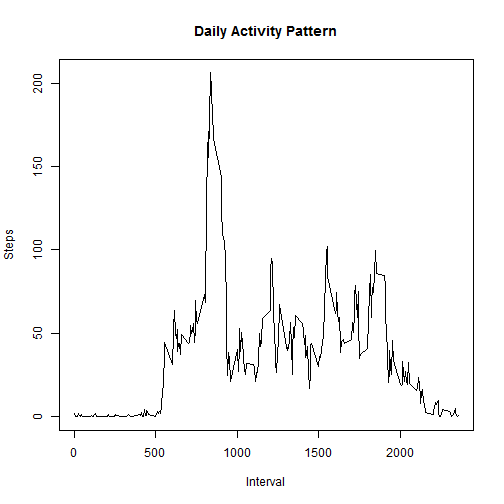

My project1 for the Reproducible Research coursera course through Johns Hopkins University.

R Markdown Websites used: 

- [R Markdown - Dynamic Documents for R](http://rmarkdown.rstudio.com)
- [Using R Markdown](https://support.rstudio.com/hc/en-us/articles/200552086-Using-R-Markdown)
- [knitr](http://yihui.name/knitr/)

## Loading and preprocessing the data

```r
library(data.table)
```

```
## data.table 1.9.4  For help type: ?data.table
## *** NB: by=.EACHI is now explicit. See README to restore previous behaviour.
```

```r
data<-read.csv("activity.csv", header=TRUE)
DT<-data.table(data)
```
**Note: I'm using the data table package for this project.**  
[Data Tables](http://cran.r-project.org/web/packages/data.table/index.html)

## What is mean total number of steps taken per day?

```r
groupByDate<-DT[, sum(steps), by = date]
setnames(groupByDate,"V1", "steps")
hist(groupByDate[,steps], main="Histogram of Steps Per Day", 
     xlab="Number of Steps", ylab="Number of Days",
     ylim=c(0,30))
```

 

```r
mean_val<-mean(groupByDate$steps, na.rm=TRUE)
median_val<-median(groupByDate$steps, na.rm = TRUE)
```
***The mean value is 10766.19.***  
***The median value is 10765.***

## What is the average daily activity pattern?

```r
groupByTime<-DT[!is.na(steps), mean(steps), by=interval]
setnames(groupByTime,"V1", "steps")
plot(groupByTime[,interval], groupByTime[,steps], type="l",
     xlab="Interval", ylab="Steps", main="Daily Activity Pattern")
```

 

```r
temp<-groupByTime[order(steps, decreasing = TRUE)]
mostSteps<-temp[1,interval]
```
***The interval with the most steps is 835.***


## Imputing missing values

```r
naCount<-sum(DT[,is.na(steps)])
```
The total number of NA values is **2304**.  
***Impute Stragegy: NA values replaced with the average steps for the interval.***

```r
DT[, steps:=as.numeric(steps)][is.na(steps),steps:={tmp<-interval; 
                                                    groupByTime[interval==tmp,steps]}]
```

```
##            steps       date interval
##     1: 1.7169811 2012-10-01        0
##     2: 0.3396226 2012-10-01        5
##     3: 0.1320755 2012-10-01       10
##     4: 0.1509434 2012-10-01       15
##     5: 0.0754717 2012-10-01       20
##    ---                              
## 17564: 4.6981132 2012-11-30     2335
## 17565: 3.3018868 2012-11-30     2340
## 17566: 0.6415094 2012-11-30     2345
## 17567: 0.2264151 2012-11-30     2350
## 17568: 1.0754717 2012-11-30     2355
```

```r
groupByDate<-DT[, sum(steps), by = date]
setnames(groupByDate,"V1", "steps")
hist(groupByDate[,steps], main="Histogram of Steps Per Day", 
     xlab="Number of Steps", ylab="Number of Days",
     ylim=c(0,40))
```

 

```r
mean_val<-mean(groupByDate$steps)
median_val<-median(groupByDate$steps)
```
The mean value using imputed data is **10766.19**.  
The median value using imputed data is **10766**.  
***There is very little difference between using the raw data set (with NA values) and the imputed data set***


## Are there differences in activity patterns between weekdays and weekends?

```r
library(ggplot2)
library(gridExtra)
```

```
## Loading required package: grid
```

```r
DT[, date:=as.Date(date)]
```

```
##            steps       date interval
##     1: 1.7169811 2012-10-01        0
##     2: 0.3396226 2012-10-01        5
##     3: 0.1320755 2012-10-01       10
##     4: 0.1509434 2012-10-01       15
##     5: 0.0754717 2012-10-01       20
##    ---                              
## 17564: 4.6981132 2012-11-30     2335
## 17565: 3.3018868 2012-11-30     2340
## 17566: 0.6415094 2012-11-30     2345
## 17567: 0.2264151 2012-11-30     2350
## 17568: 1.0754717 2012-11-30     2355
```

```r
str(DT) #date field now of type Date instead of factor
```

```
## Classes 'data.table' and 'data.frame':	17568 obs. of  3 variables:
##  $ steps   : num  1.717 0.3396 0.1321 0.1509 0.0755 ...
##  $ date    : Date, format: "2012-10-01" "2012-10-01" ...
##  $ interval: int  0 5 10 15 20 25 30 35 40 45 ...
##  - attr(*, ".internal.selfref")=<externalptr>
```

```r
DT[, dayOfWeek:=ifelse(weekdays(date) %in% c("Saturday", "Sunday"), "weekend", "weekday")]
```

```
##            steps       date interval dayOfWeek
##     1: 1.7169811 2012-10-01        0   weekday
##     2: 0.3396226 2012-10-01        5   weekday
##     3: 0.1320755 2012-10-01       10   weekday
##     4: 0.1509434 2012-10-01       15   weekday
##     5: 0.0754717 2012-10-01       20   weekday
##    ---                                        
## 17564: 4.6981132 2012-11-30     2335   weekday
## 17565: 3.3018868 2012-11-30     2340   weekday
## 17566: 0.6415094 2012-11-30     2345   weekday
## 17567: 0.2264151 2012-11-30     2350   weekday
## 17568: 1.0754717 2012-11-30     2355   weekday
```

```r
weekdayGroup<-DT[dayOfWeek=="weekday"][, mean(steps), by=interval]
weekendGroup<-DT[dayOfWeek=="weekend"][, mean(steps), by=interval]
setnames(weekdayGroup,"V1", "steps")
setnames(weekendGroup,"V1", "steps")
p1<-ggplot(weekdayGroup,aes(x=interval, y=steps)) + geom_line() + 
    labs(title = "Weekdays", y="Number of Steps", x="Five Minute Intervals") +
    scale_y_continuous(limits=c(0,250))
p2<-ggplot(weekendGroup,aes(x=interval, y=steps)) + geom_line() + 
    labs(title = "Weekends", y="Number of Steps", x="Five Minute Intervals") +
    scale_y_continuous(limits=c(0,250))
grid.arrange(p1, p2, ncol=1)
```

 
  
***There are differences in the patterns between the weekdays and the weekends. During the weekdays the majority of the steps are in the morning. On the weekends the steps are more evenly distributed through out the day.***


